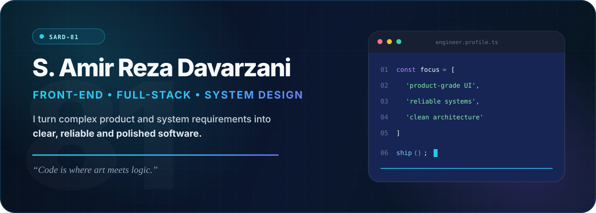
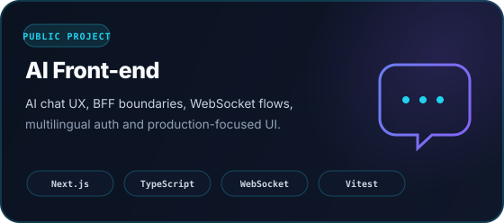
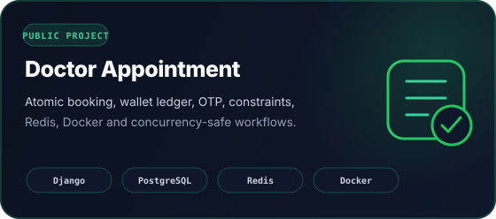
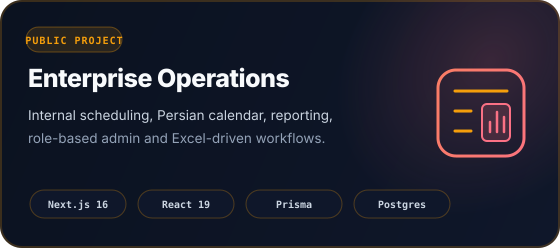
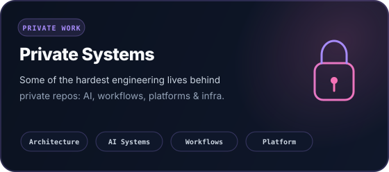

<p align="center">
  
</p>

<h3 align="center"><i>“Code is where art meets logic.”</i></h3>

<p align="center">
  
</p>

<p align="center">
  <a href="https://github.com/SARD-81"></a>
  <a href="https://www.linkedin.com/in/seyyed-amir-reza-davarzani-13812003j"></a>
  <a href="mailto:sard81.dev@gmail.com"></a>
</p>

<br/>

## 👋 What I build

I'm **S. Amir Reza Davarzani** — a front-end-focused full-stack developer. I like the parts of software where polished UX meets architecture, data contracts, correctness and real deployment constraints.

```ts
const engineer = {
  focus: ["product-grade frontend", "full-stack systems", "system design"],
  caresAbout: ["UX", "correctness", "performance", "maintainability"],
  currentDirection: ["AI interfaces", "enterprise software", "real-time experiences"],
};
```

I don't want complex systems to *look* complex. The work underneath can be hard; the experience on top should feel obvious.

## ✦ Featured engineering

<p align="center">
  <a href="https://github.com/SARD-81/AI_Front-end"></a>
  <a href="https://github.com/SARD-81/doctor-appointment-system"></a>
</p>

<p align="center">
  <a href="https://github.com/SARD-81/storex-group-luanch-managments"></a>
  
</p>

Public repositories show part of the picture. Some of my most technically demanding work is in **private or organization-owned codebases** involving enterprise systems, AI products, workflow platforms, backend foundations and infrastructure. The code stays private; the architecture, trade-offs and engineering decisions can still be discussed when appropriate.

## 🧰 Toolbox

<p align="center">
  
</p>

<p align="center">
  <code>TypeScript</code> · <code>React</code> · <code>Next.js</code> · <code>Django</code> · <code>NestJS</code> · <code>PostgreSQL</code> · <code>Redis</code> · <code>Docker</code> · <code>Linux</code>
</p>

## ⚙️ Engineering DNA

- **Product-grade UI** — responsive states, RTL/i18n, accessibility, loading/failure paths and UX details matter as much as the happy path.
- **Correctness over cleverness** — validation, transactions, invariants, authorization and predictable failures come first.
- **Architecture with a purpose** — clean boundaries, ADRs, service layers and reusable primitives should reduce future cost, not add ceremony.
- **Ship safely** — focused branches, reviewable commits, tests, CI and deployment discipline are part of implementation.

<details>
<summary><b>More about the engineering behind the work</b></summary>
<br/>

My recent work spans **Next.js App Router and BFF patterns, WebSocket chat flows, Django/DRF services, PostgreSQL transaction safety, Redis-backed systems, Docker/Nginx deployment, monorepo foundations, CI quality gates and team-oriented Git workflows**.

I also spend time on the less visible parts of delivery: defining technical baselines, reviewing architecture decisions, coordinating dependent work, hardening authentication boundaries, debugging production behavior and making sure the next change is easier than the previous one.

</details>

<br/>

## 🤝 Connect

<p align="center">
  <a href="https://www.linkedin.com/in/seyyed-amir-reza-davarzani-13812003j"></a>
  <a href="mailto:sard81.dev@gmail.com"></a>
</p>

<p align="center">
  <sub>Build clearly. Design deliberately. Ship reliably.</sub>
</p>
